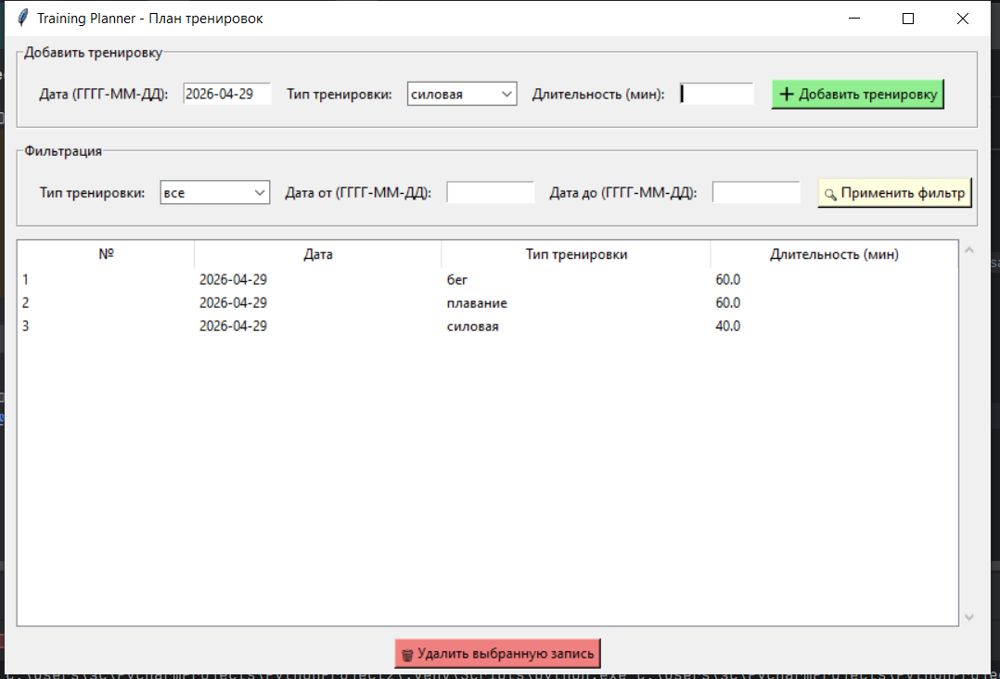
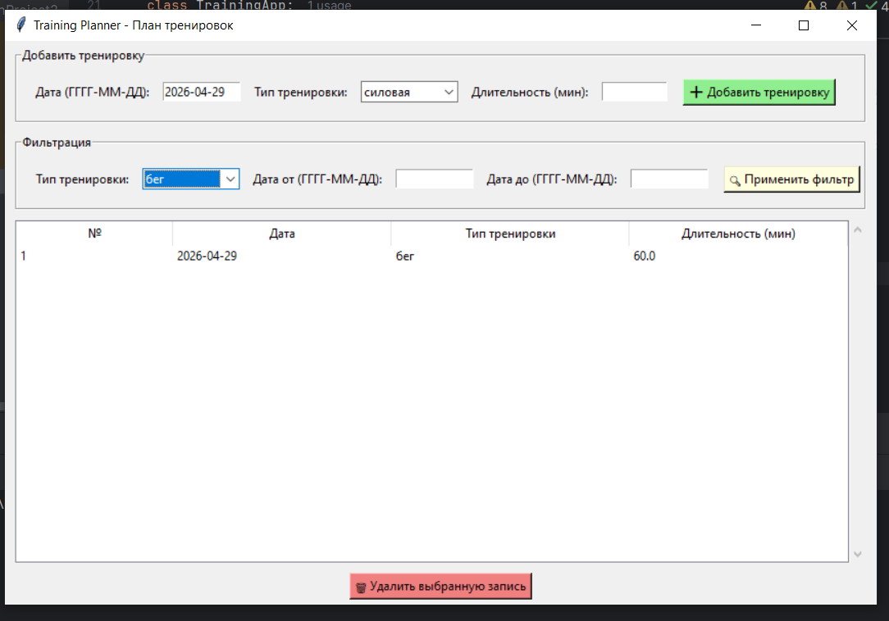

# Training Planner (План тренировок)

**Автор:** Мавлетов Данил Викторович  
**Вариант:** Training Planner  
**Дата сдачи:** 29.04.2026

## Описание программы

Приложение для планирования тренировок. Позволяет добавлять тренировки с указанием даты, типа и длительности, фильтровать по типу и периоду. Все данные сохраняются в JSON-файл.

## Требования для запуска

- Python 3.10 или выше
- Tkinter (входит в стандартную поставку Python)

## Как запустить

```bash
git clone https://github.com/danil2291339/training-planner.git
cd training-planner
python main.py
```

## Как пользоваться

1. **Добавление тренировки:** введите дату, выберите тип, укажите длительность → нажмите «Добавить тренировку»
2. **Фильтрация:** выберите тип или укажите период (дата от/до) → нажмите «Применить фильтр»
3. **Удаление:** выберите запись в таблице → нажмите «Удалить выбранную запись»

## Пример работы

**Добавление тренировки:**  
Вводим дату «2026-04-30», тип «бег», длительность «30» → нажимаем «Добавить тренировку» → запись появляется в таблице.

**Фильтрация по типу:**  
Выбираем тип «плавание» → нажимаем «Применить фильтр» → показываются только тренировки по плаванию.

**Фильтрация по дате:**  
Указываем даты от «2026-04-01» до «2026-04-30» → нажимаем «Применить фильтр» → показываются тренировки только за апрель.

## Структура JSON-файла

```json
[
  {
    "id": 1,
    "date": "2026-04-30",
    "type": "бег",
    "duration": 30
  },
  {
    "id": 2,
    "date": "2026-04-29",
    "type": "плавание",
    "duration": 45
  }
]
```

## Тестирование

| Тип теста | Пример | Результат |
|-----------|--------|------------|
| Позитивный | Дата 2026-04-30, тип бег, длительность 30 | ✅ Добавлено |
| Негативный | Длительность -10 | ❌ Ошибка: длительность должна быть положительной |
| Негативный | Длительность «abc» | ❌ Ошибка: введите число |
| Негативный | Дата «30.04.2026» | ❌ Ошибка: неверный формат |
| Граничный | Длительность 0.1 | ✅ Добавлено |

## Скриншоты





## Ссылка на GitHub

[https://github.com/danil2291339/training-planner](https://github.com/danil2291339/training-planner)
